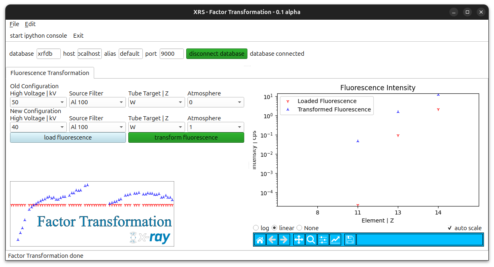
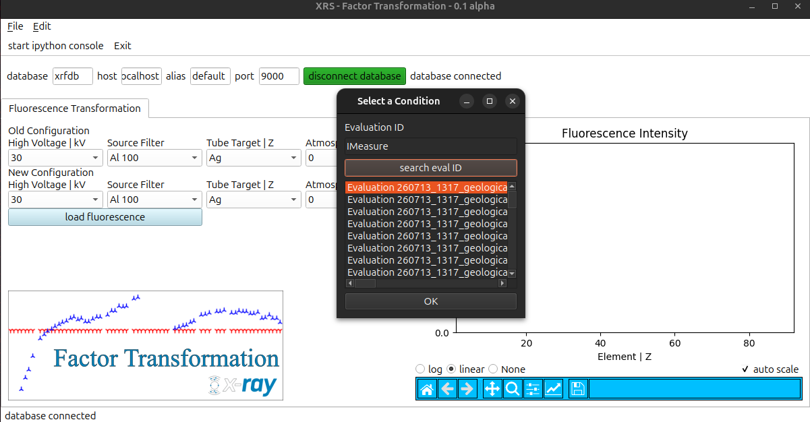

.. _ref-detailed-description:

Detailed GUI Description
========================

This document describes the different aspects of the GUI and their functionalities.
For a detailed description of the fitting process please refer to :ref:`detailed fitting description <ref-detailed-fitting-description>`.

.. _ref-GUI:

   Figure 1: Displayed is the GUI for the Factor Transformation.

In :ref:`Figure 1 <ref-GUI>` the GUI for the fluorescence transformation is displayed. To transform fluorescence load the fluorescence.

.. _ref-GUI-load:

   Figure 2: Displayed is the loading instance in the GUI for the Factor Transformation.

When the button is pressed, a window pops up (see :ref:`Figure 2 <ref-GUI-load>`). By entering an evaluations ID the XRFDB is queried and possible Evaluations are displayed. Select on an verify with OK.
The conditions are loaded automatically. 
!!WARNING
The target is not stored in any document, so it is read out from the ID. If this fails, it has to be selected manually!!
WARNING!!
The new conditions should be entered. When finished, the selected conditions should be verified and the fluorescence transformed by pressing "transform fluorescence".
The transformed fluorescence intensities are plotted alongside the loaded intensities.
