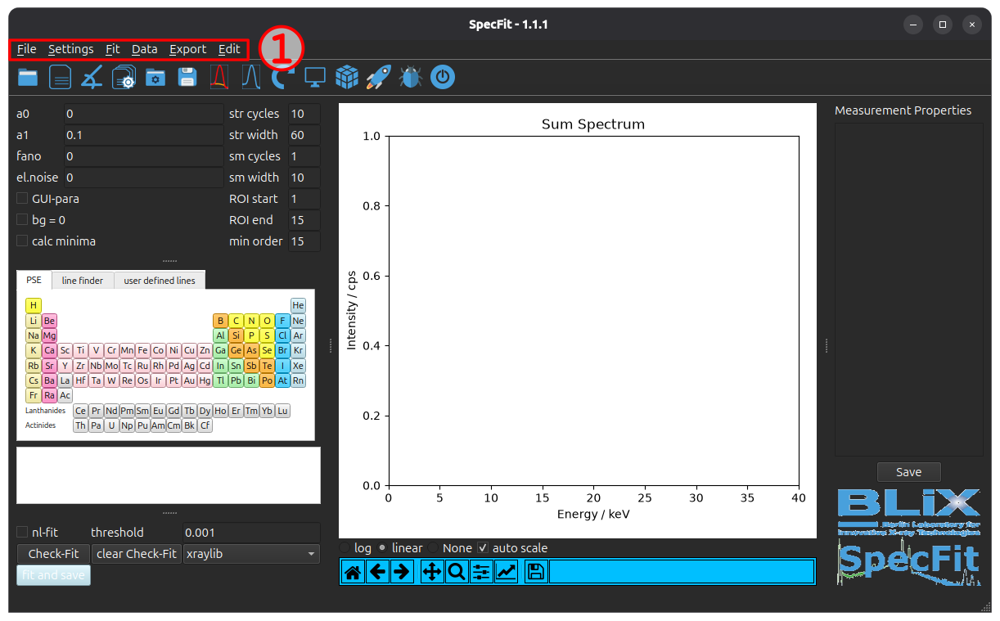
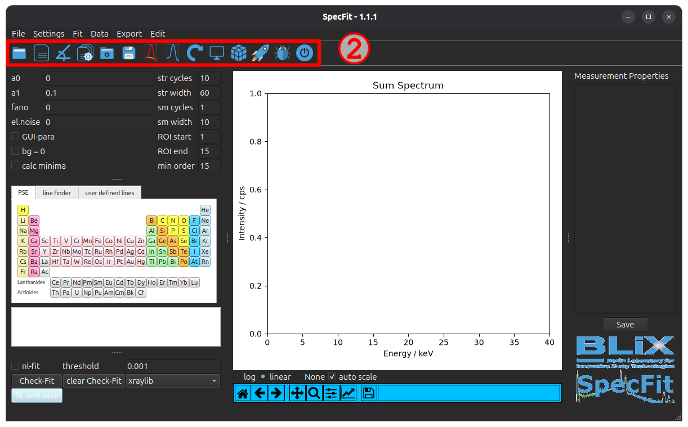
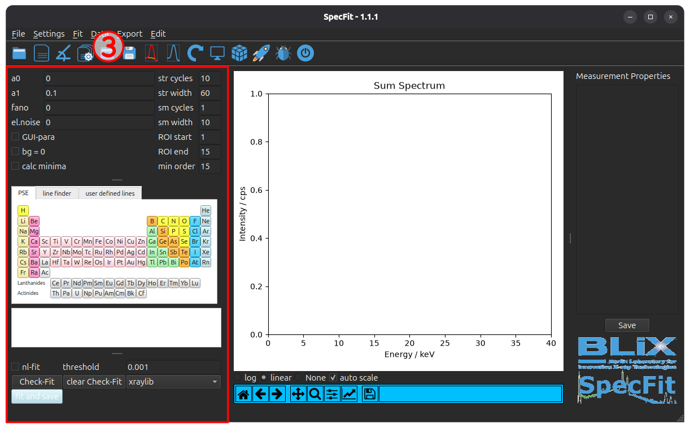
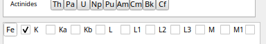
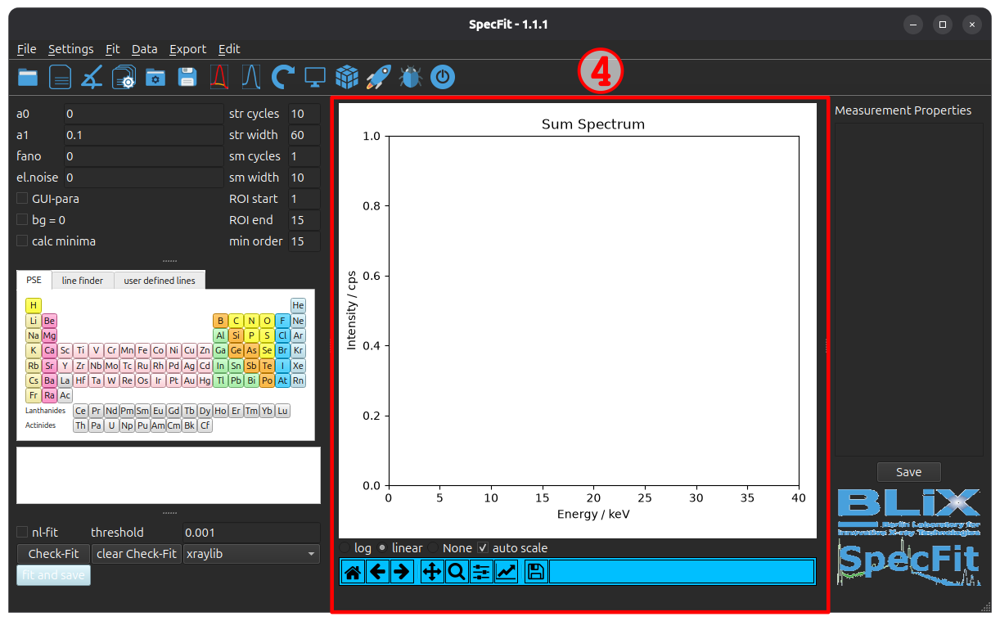
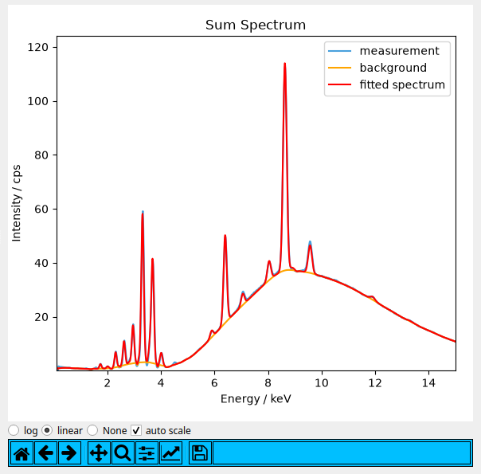
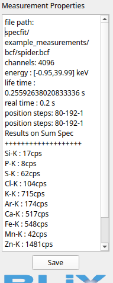

.. _ref-detailed-description:

Detailed GUI Description
========================

This document describes the different aspects of the GUI and their functionalities.
For a detailed description of the fitting process please refer to :ref:`detailed fitting description <ref-detailed-fitting-description>`.

.. _ref-GUI-overview:
.. figure:: _static/images/specfit_main.png
  :class: responsive-image
  :align: center
  :width: 100%

  Figure 1: Displayed is the main window of the **SpecFit** GUI. 

In :ref:`Figure 1 <ref-GUI-overview>` the default GUI of **SpecFit** is displayed.
The GUI is sectioned into different parts that will be explained successively.

Menu Bar
--------

.. _ref-GUI-menu-bar:

  Figure 2: Highlighted is the menu bar of the **SpecFit** GUI.

At the top of the GUI is the menu bar (see :ref:`Figure 2 <ref-GUI-menu-bar>`).
It allows you to access different functionalities provided by **SpecFit**.
The functionalities are listed in :ref:`Table 1<ref-table-menus>`.

.. _ref-table-menus:
.. list-table:: Table 1: List of Menus
  :header-rows: 0
  :class: menu-entries

  * - .. image:: _static/images/menu_file.png
    - **File Menu**

      | - *load folder* - load a folder *Ctrl O*
      | - *load file* - load a file *Ctrl Shift O*
      | - *load angle file* - load an angle file *Ctrl Shift A*
      | - *batch fit* - perform batch fitting *Ctrl Shift B*
      | - *Recent Folder* - opens previously loaded folder
      | - *Recent File* - opens previously loaded file
      | - *Exit* - closes the application *Ctrl Q*

  * - .. image:: _static/images/menu_settings.png
    - **Settings**
      
      | - *load settings-file* - Opens a settings file *Ctrl Shift S*
      | - *save settings-file* - Save the settings *Ctrl Shift P*
      | - *set fit settings* - Set specific fit settings *Ctrl S*

  * - .. image:: _static/images/menu_fit.png
    - **Fit**
      
      | - *fit and save* - start the fitting procedure and save *F1*.
      | - *check fit* - test the fitting parameters *F5*.
      | - *clear plot* - clear the fit and display the spectrum *F4*.
      | - *clear elements and lines* - clear selected elements *F2*.

  * - .. image:: _static/images/menu_data.png
    - **Data**
      
      | - *view ROI* - open the energy ROI window *F6*.
      | - *maximum pixel spectrum* - calculate and show the 
      | spectrum with maximum intensities per energy.
      | - *plot 3D* - open the 3D plot window *F8*.
      | - *display meas points 3D* - open the measurement 
      | points 3D display window.
      | - *show counts* - show the overall counts of the  
      | measurement *depreceated*.

  * - .. image:: _static/images/menu_export.png
    - **Export**
      
      | - *export npy* - export h5 to npy
      | - *convert .npy to .bin* - compress .npy to .bin
      | - *results.h5 to .tiff* - export results as .tiff images

  * - .. image:: _static/images/menu_edit.png
    - **Edit**
      
      | - *start ipython console* - open debugging shell

Actions
-------

.. _ref-GUI-action:

  Figure 3: Highlighted is the action bar of the **SpecFit** GUI.

Below the menu bar is the action bar (see :ref:`Figure 3<ref-GUI-action>`).
Actions allow you the fast access to common functionalities like loading, ROI investigation or fitting.
Please refer also to the hotkeys for the different functionalities as stated in :ref:`Table 1<ref-table-menus>`
The available actions are listed along there icon in :ref:`Table 2<ref-table-actions>`.

.. _ref-table-actions:
.. list-table:: Table 2: List of Actions
  :widths: 15 85
  :header-rows: 0
  :class: action-icons

  * - .. image:: _static/icons/folder-blue-open-icon.png
        :width: 32px
    - **Open Folder**
      
      Opens a folder containing spectra.

  * - .. image:: _static/icons/file-open.png
        :width: 32px
    - **Open File**
      
      Opens a spectrum or composite file.

  * - .. image:: _static/icons/angle-open.png
        :width: 32px
    - **Open Angle Resolved Measurement**
      
      Opens an angle resolved measurement, e.g. GE-XRF or GI-XRF.

  * - .. image:: _static/icons/batch_fitting.png
        :width: 32px
    - **Batch Fitting**
      
      Fitting of multiple files and folders with the same fitting parameters.

  * - .. image:: _static/icons/settings-open.png
        :width: 32px
    - **Open Settings File**
      
      Load a settings file to automatically set fitting parameters.

  * - .. image:: _static/icons/settings-save.png
        :width: 32px
    - **Save Settings File**
      
      Save the set of fitting parameters.

  * - .. image:: _static/icons/check-fit.png
        :width: 32px
    - **Check Fit**
      
      Test the fitting parameters on the loaded spectrum.

  * - .. image:: _static/icons/clear-plot.png
        :width: 32px
    - **Clear Fit**
      
      Clears the plotted fit to display the original spectrum.

  * - .. image:: _static/icons/clear-elements.png
        :width: 32px
    - **Clear Elements**
      
      Clears the element selection.

  * - .. image:: _static/icons/show-ROI.png
        :width: 32px
    - **Show Energy ROI**
      
      Opens the energy region of interest (ROI) investigation window.

  * - .. image:: _static/icons/plot-3d.png
        :width: 32px
    - **Plot 3D**
      
      Opens the overview 3D plot window.

  * - .. image:: _static/icons/fit-and-save.png
        :width: 32px
    - **Fit and Save**
      
      Starts the fitting procedure and stores the evaluated intensities.

  * - .. image:: _static/icons/bug.png
        :width: 32px
    - **Debugging Shell**
      
      Opens a debugging IPython shell with access to **SpecFit** parameters.

  * - .. image:: _static/icons/exit.png
        :width: 32px
    - **Exit**
      
      Closes the application.

Fitting
-------

.. _ref-GUI-fit:

  Figure 4: Highlighted is the fitting section of the **SpecFit** GUI.

Below the action bar the main section is located. This is split in 3 columns, left *fitting*, center *plotting* and right *information*.
In :ref:`Figure 4<ref-GUI-fit>` the fit section is highlighted.

In the upper fit section parameters for the fit can be adjusted. A short description of the parameter can be found in :ref:`Table 3<ref-table-fit>`.
For a detailed description of the fitting procedure please refer to :ref:`detailed fit description <ref-detailed-fitting-description>`.

.. _ref-table-fit:
.. table:: Table 3: Fit parameters   

  ===========  ============
  Parameter    Explanation   
  ===========  ============
  a0           lowest measured energy
  a1           linear increment of the energy
  Fano         Fano factor of the utilised detector
  el.noise     width of lines
  GUI para     if Checked, use entered parameter for fit
  bg=0         if Checked, set background to 0
  calc minima  if Checked, calculate inflection point using argrelextrema for background estimation 
  str cycles   number of stripping cycles
  str width    width of stripping filter
  sm cycles    number of smoothing cycles
  sm width     with of smoothing filter
  ROI start    lower energy limit for fit
  ROI end      upper energy limit for fit
  min order    order in argrelextrema calculation
  ===========  ============

Below the fit parameter section the element fluorescence line selection is located. The elements can be selected by clicking on the corresponding checkboxes.

.. _ref-GUI-line-selection:

  Figure 5: Displayed is the element line selection section which is generated when an element is selected from the periodic table.

In :ref:`Figure 5<ref-GUI-line-selection>` the line selection section is displayed. The lines available are provided by `xraylib <https://github.com/tschoonj/xraylib/wiki/Appendix-xraylib-macros#x-ray-fluorescence-line-macros>`__ and are listed in :ref:`Table 4<ref-table-fluorescence-lines>`. The lines can be selected by clicking on the corresponding checkboxes.

.. _ref-table-fluorescence-lines:
.. table:: Table 4: Fluroescence lines  
  
  ===========  ============
  Line         Transitions   
  ===========  ============
  K            all K-lines available by *xraylib*
  Ka           KL3, KL2, KL1
  Kb           all K-lines available by *xraylib* except Ka
  L            all L-lines available by *xraylib*
  L1           all L-lines available by *xraylib* falling into the L1 shell
  L2           all L-lines available by *xraylib* falling into the L2 shell 
  L3           all L-lines available by *xraylib* falling into the L3 shell 
  M            all M-lines available by *xraylib*
  M1           all M-lines available by *xraylib* falling into the M1 shell
  M2           all M-lines available by *xraylib* falling into the M2 shell
  M3           all M-lines available by *xraylib* falling into the M3 shell
  M4           all M-lines available by *xraylib* falling into the M4 shell
  M5           all M-lines available by *xraylib* falling into the M5 shell
  ===========  ============

Below the line selection section the fitting execution buttons are located. The checkbox *nl-fit* allows to perform a non-linear energy calibration. The *threshold* entry allows to set the residual threshold for the energy calibration fit. The default is 0.001.
To start the non-linear energy calibration fit, the *nl-fit* checkbox has to be checked and the *Check-Fit* button has to be pressed. In the terminal the fitting process and output is plotted. When the fit finished, the spectrum is plotted.
The *Check-Fit* button in general allows to test the fitting parameters on the sum spectrum. The *clear Check-Fit* clears the plot.
The drop-down box let's the user change between different X-ray specific databases. Currently only the *xraylib* database is supported and available.
If the blue *fit and save* button is pushed, the fitting procedure is started.

Plotting
--------
In the center of the GUI the plotting section is located (see :ref:`Figure 6<ref-GUI-plotting>`).

.. _ref-GUI-plotting:

  Figure 6: Displayed is the highlighted plotting section.

When a measurement is loaded, it displays the sum spectrum. When a check fit is performed, the fitted background and fluorescence line peaks are displayed.

.. _ref-GUI-plotting-fitted-spectrum:

  Figure 7: Displayed is the plotting section with a :blue:`loaded spectrum` (blue), fitted :orange:`background` (orange) and :red:`fluorescence line` (red) peaks.

In :ref:`Figure 7<ref-GUI-plotting-fitted-spectrum>` the plotting section is displayed with a :blue:`loaded spectrum` (blue), fitted :orange:`background` (orange) and :red:`fluorescence line` (red) peaks.
Below the plotting field 3 radio buttons are located which allow to switch the scaling on the y-axis between linear (*linear*) and logarithmic (*log*). If *None* is selected, no spectrum is displayed. This is useful to speed up the fitting process when fitting large datasets.
Right of the radio buttons a checkbox *auto scale* is located. If checked, the y-axis is automatically scaled to the maximum intensity * 1.1 and minimum intensity * 0.9. If the checkbox is unchecked, the y-axis is not changed during the plotting process.
At the bottom the navigation toolbar of *matplotlib* is located. It allows to zoom, pan and save the displayed plot. For a detailed description refer to the `matplotlib documentation <https://matplotlib.org/3.2.2/users/navigation_toolbar.html>`__. 

Measurement Properties
----------------------
On the right side of the GUI the measurement properties are displayed (see :ref:`Figure 8<ref-GUI-measurement-properties>`).

.. _ref-GUI-measurement-properties:

  Figure 8: Displayed is the measurement properties section. The filepath and measurement properties are displayed. If a checkfit is performed, the fitted fluorescence lines intensitiies are given.