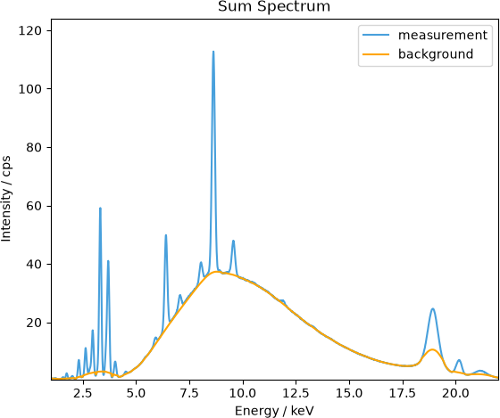
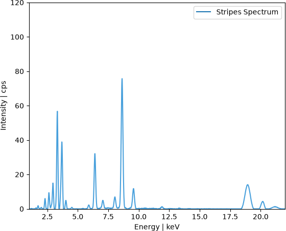

.. _ref-detailed-fitting-description:

Detailed Fitting Description 
============================

In this section we will discuss the procedures that **SpecFit** utilises for the evaluation of X-ray fluorescence spectra.
In general the fluorescence intensity is evaluated by

  1. estimation of the background
  2. subtraction of the background
  3. gaussian fit at selected fluroescence energy

Those are the 3 necessary steps to evaluate the X-ray fluorescence intensities.
The complete list of functionalities used for spectrum deconvolution are referenced :ref:`here<ref-specfit-deconvolution-code>`

.. _ref-ancient-SpecFit-procedure:
.. figure:: _static/images/SpecFit\ Docu.png
  :class: responsive-image
  :align: center
  :width: 100%

  Figure 1: A copy of the spectrum deconvolution procedure in the `long long ago <https://en.wikipedia.org/wiki/Ancient_history>`__.

.. _ref-background-estimation:

Background Estimation
---------------------
To evaluate the X-ray fluorescence intensity the background of a X-ray fluorescence spectrum has to be estimated and removed in order to separated the fluorescence signal for evaluation.
A exemplary spectrum and the :orange:`background` estimation is displayed in :ref:`Figure 2 <ref-background-fit>`. 

.. _ref-background-fit:

  Figure 2: Displayed is the estimated :orange:`background`. 

The fit is overall good but disagrees at lower energies with a lot of fluorescence lines and at the broad Compton scattered peak at about *19 keV*.
The fit can be improved by either changing the region of interest for the deconvolution or by adjusting the cycles and width of the deconvolution.
The function which estimates the :orange:`background` is :py:meth:`functions.specfit_deconvolution.SpecFit.strip`.
A `moving average <https://en.wikipedia.org/wiki/Moving_average>` is applied to smooth the background and to erase high frequent signals like fluorescence peaks. The width of the average can be adjusted with the entry field *str width*, the number of cycles with *str cycles*.
The order is

  1. smoothing (*sm cycles*) of the spectrum via moving average (*sm width*)
    
    - value is set to average regardless

  2. backround estimation (*str cycles*) via moving average (*str width*)
  
    - value is only set to average if spectrum is larger

.. _ref-stripped_spectrum-fit:

  Figure 3: Displayed is the background corrected (stripped) :blue:`spectrum`. 

In :ref:`Figure 3 <ref-stripped_spectrum-fit>` the background subtracted (stripped) spectrum is displayed. Approximately only the fluorescence signal is remaining.

Fluorescence Peak Estimation
----------------------------

The remaining fluorescence signal is then approximated by a normal distribution. The function which performs the fit is :py:meth:`functions.specfit_deconvolution.SpecFit.linfit`.
The procedure is

  1. For each lineset add a normal distribution with area = 1 weighted by their transition probabilities at the specific energy positions.
  2. Fit the normal distributions to the stipped spectrum retaining the relations given by the transition probabilities.
  3. Return the fluorescence intensities per fluorescence line set.

The calculated normal distribution areas are directly related to the fluorescence intensity. The results are returned or saved in an HDF5 file.

Escape Peak Estimation
----------------------

Escape peaks are characteristics of the most common X-ray fluorescence detectors, the silicon drift detectors (SDD). Here a fluorescence photon of Silicon is escaping the detector and thus reducing the detected energy by its excitation energy of *1.74 keV*.
To calculate the escape peaks in **SpecFit** the *Fit-Settings* have to be opened via *Ctrl+S* or via the *Settings* menu. You have to check the *fit escape* checkbox to activate escape fitting.
The probability for an escape peak is empiricaly estimated. The probability *escape threshold* can be set and is *1e-3* by default. The empirical factor can be adjusted by the *escape factor*, which is *0.8* by default.
The calculation of the probabilities is done in :py:meth:`functions.specfit_deconvolution.SpecFit.pile_up_lines`.

.. warning:: |ico1| Be aware that the spectrum normaly displayed is the sum spectrum over all loaded measurements. If the measurement is inhomogeneous the background and escape peaks in the sum spectrum will be different from the single spectra. |ico1|

Pile-Up Estimation
------------------

Similar to the escape peak the pile-up peaks are empirically estimated. Pile-Up occurs when within the readout time of the detector 2 or more signals are registered simultaneously. The signals cannot be separated and are registered at 1 at the sum of the participating energies.
To activate pile-up fitting, the *Fit-Settings* have to be opened and *fit pile-up* has to be checked.
The *pile-up threshold* and the *pile-up factor* can be adjusted for the measurement and setup conditions.
The calculation of the probabilities is done in :py:meth:`functions.specfit_deconvolution.SpecFit.pile_up_lines`.

.. warning:: |ico1| Be aware that the spectrum normaly displayed is the sum spectrum over all loaded measurements. If the measurement is inhomogeneous the background and pile-up peaks in the sum spectrum will be different from the single spectra. |ico1|

Batch Fitting
-------------

**SpecFit** allows to evaluate multiple files of the same file type with the settings selected.
To use batch fitting please load the folder where the files are stored with |ico2| or *Ctrl+Shift+B*.

.. warning:: |ico1| Currently only .spx and .bcf files are supported. |ico1|

.. _ref-specfit-deconvolution-code:

SpecFit Deconvolution Code
--------------------------
Listed are the functions of the specfit_deconvolution Class which performs the deconvolution of the X-ray fluorescence spectra.

.. autoclass:: functions.specfit_deconvolution.SpecFit
    :members:
    :undoc-members: