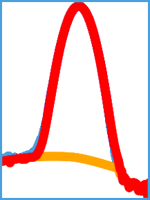
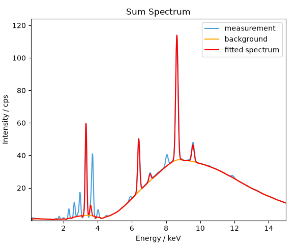
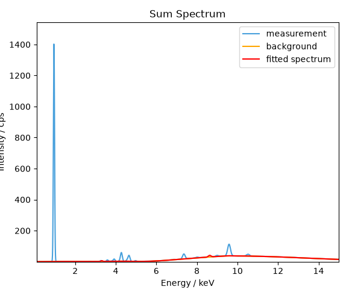
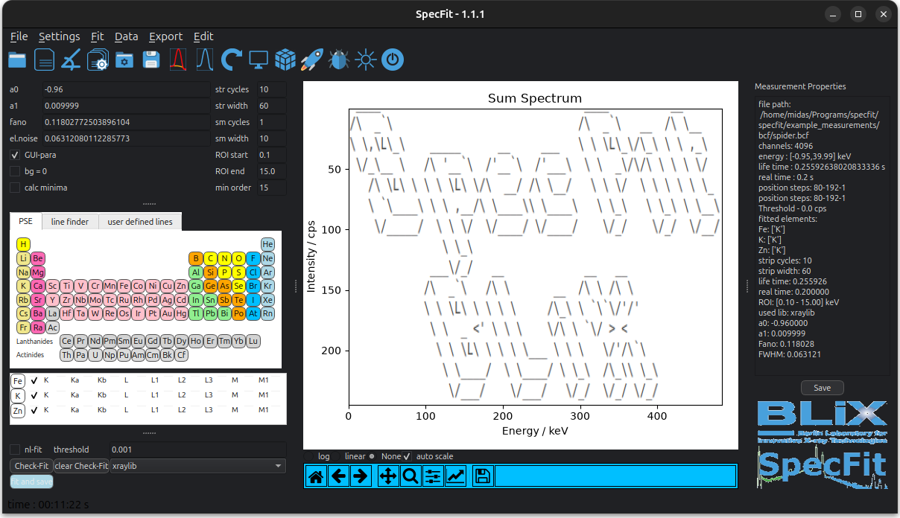

.. _ref-how-to:

HowTo
=====
This documentation displays the example usage of **SpecFit**. In this tutorial you will follow the steps:

  - start **SpecFit**
  - load a measurement
  - select element fluorescence lines
  - adjust the fitting parameters
  - start a fit and retrieve the fluroescence intensities

Summarising, in this **HowTo** you will learn how to open a measurement file, select elements, adjust the fitting parameters and finally perform the fitting of the spectra and extract the fluorescence intensities.  
There are several example measurements of different supported file formats under *specfit/example measurements*.

Start SpecFit
-------------
To start **SpecFit** please first install it following the instructions in the :ref:`Installation <ref-Installation>` section. After the installation you can start **SpecFit** by executing the following command in a terminal:

.. code-block:: bash

   cd move/to/specfit
   specfit

**SpecFit** will start and the main GUI will be displayed as shown in Figure 1. The main GUI consists of several menus, a toolbar and a status bar. The main GUI is divided into several sections which are described in detail in the :ref:`Detailed GUI Description <ref-detailed-description>` section.

.. _ref-specfit-main-howto:
.. figure:: _static/images/specfit_main.png
   :class: responsive-image
   :align: center
   :width: 100%

   Figure 1: Displayed is the main graphical user interface of **SpecFit** when started.

Open File
---------
You will now load a provided *Bruker composite file .BCF* file containing a 2D measurement of a `spyder <https://docs.spyder-ide.org/current/index.html>`_. For this please press the *Open File* |ico1| button.
You will be prompted to select a file. Navigate to the *specfit/example_measurements/bcf* folder and select the *spider.bcf* file. After selecting the file, press the *Open* button. The measurement will be loaded and the sum spectrum will be displayed in the plotting section as a :blue:`blue` curve.
The fitting parameters are automatically set from the file (energy calibration) and as default values.

Select Elements
---------------
You will now select the most prominent fluorescence lines in the spectrum. For this in the periodic table please select the elements **K**, **Fe** and **Zn**. When an element is selected a vertical line indicates the fluorescence line energy of the *K* or *L3* line of the element respectively.
The selected elements will be listed in the element selection section below the periodic table. Here the fluorescence lines can be adjusted. Please refer to the :ref:`detailed GUI description <ref-detailed-description>` section.

To check the fit on the sum spectrum, please press the |ico2| button. You can alternatively press *F5*.

.. _ref-fit-howto:

   Figure 2: Displayed is the fit with the loaded fit parameter.

In :ref:`Figure 2 <ref-fit-howto>` the fitted spectrum is displayed in :red:`red` and the estimated background in :orange:`orange`. You can clearly see, that the selected elements are not sufficient to reproduce the spectrum, so there must be elements and fluorescence lines missing. Feel free to play around it later.

Adjust Fitting Parameter
------------------------
For now we will shortly adjust the fitting parameters. For this to take effect, please check the *GUI-para* checkbox. This will guarantee that the entered parameter are used for fit and not the loaded. We will now change the energy calibration parameter **a0** to 0, check fit.

.. _ref-fit-howto-worse:

   Figure 3: Displayed is the fit with the energy parameter **a0** set to 0. The fit is obviously bad.

In :ref:`Figure 3 <ref-fit-howto-worse>` we see the fit. Ops, this went bad. Better change **a0** back to *-0.96*, better. Puh. Fitting ain't easy.
Please make yourself comfortable with the influence of the fitting parameters on the fit. You can also check the :ref:`detailed fitting description <ref-detailed-fitting-description>` section for more details.

Finally Fitting!
----------------
In the final step, you are now satisfied with the checked fit and want to utilise the parameter for the complete loaded dataset. For this simply press the |ico3| button or the :blue:`*fit and save*` button. You will be asked to select a save folder. As default a *results* folder is pre-created. Please select this one.
Now all spectra in the dataset will be fitted with the selected set of elements and fluorescence lines and the fitting parameters provided. You can directly interpret the accurracy of the fit and adjust the parameter for the next run.
When the fit is finished a *results.h5* is saved in the *results/* folder. You can easily inspect the file with `NexPy <https://nexpy.github.io/nexpy/>`_.

.. _ref-fit-howto-done:

   Figure 4: Fit is finished.

You are now all set up to fit with **SpecFit**.
