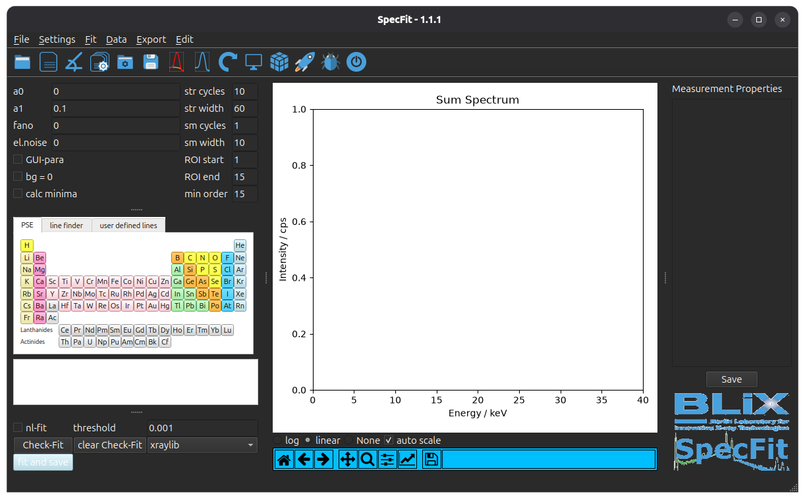

.. _ref-how-to:

How To
======
This documentation displays the example usage of **SpecFit**. There are several
example measurements of different supported file formats under
*specfit/example measurements*.

For this HowTo documentation we will load a *.BCF* file containing a measurement
of a `spyder <https://docs.spyder-ide.org/current/index.html>`_.
.. _ref-specfit-main:

   Figure 1: Displayed is the main graphical user interface of **SpecFit** when started.

ICDD Evaluation Class
---------------------
The class ICDD_evaluation allows the loading of the data and different evaluation methods.

.. autoclass:: Evaluation_ICDD.ICDD_evaluation
    :members:
    :undoc-members: