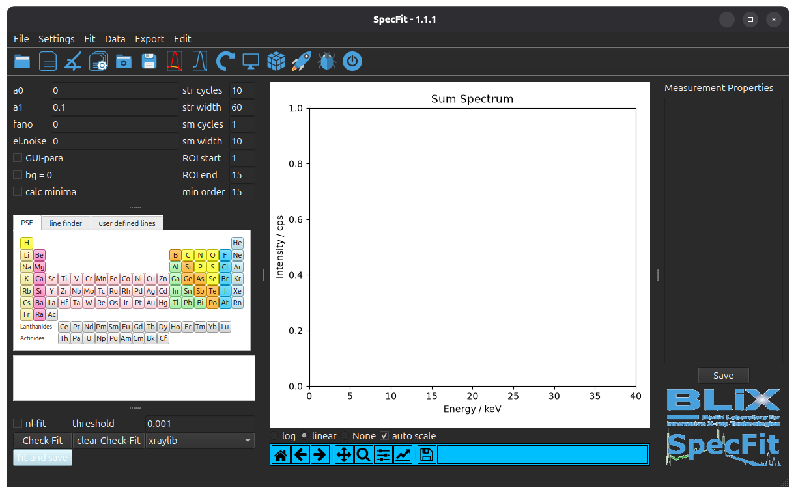

.. _ref-overview:

Overview and Purpose
====================
The software **SpecFit** is developed to calculate the fluorescence intensities of 
multiple X-ray fluorescence lines from an X-ray fluorescence spectrum. The fluorescence
intensity is calculated by a rolling mean to estimate and subtract the background
and normal peak fitting to caluclate the fluorescence intensities.

**SpecFit** can handle up to 3D datasets. Various datatypes are supported. For
a detailed list of supported data formats please see :ref:`Supported Formats <ref-supported-formats>`

If you intend to use SpecFit, please install it first (see :ref:`Installation <ref-Installation>`)

After installation you can run SpecFit from the command line with the alias
*specfit*.

   .. code-block:: bash

      specfit 

.. _ref-specfit-main:

   Figure 1: Displayed is the main graphical user interface of **SpecFit** when started.

In :ref:`Figure 1 <ref-specfit-main>` the GUI of **SpecFit** when started is displayed.
The GUI is split in 3 sections, the left panel contains the fitting parameters and element fluorescence line selection. 
In the middle panel the evaluated spectra are displayed. 
And finally in the right panel information about the loaded measurement and utilised fitting parameter is printed.

To calculate the fluorescence intensities of an X-ray fluorescence spectrum the 
spectrum has to be loaded. Subsequently the element fluorescence lines can be identified and
selected for deconvolution. The fitted background and peaks are displayed and 
the fitting parameter can be adjusted to optimise the fitting results. To retrieve
the final fluorescence intensities a fit has to be executed. The resulting 
fluorescence intensities are then stored in a hierarchical *HDF5* file. 

For a step-by-step instruction of the fitting process please refer to :ref:`HowTo <ref-how-to>`.

A detailed description of the GUI handling can be found in :ref:`detailed description <ref-detailed-description>`.

For a detailed description of the fitting process please refer to :ref:`detailed fitting description <ref-detailed-fitting-description>`.

Besides the spectral fitting **SpecFit** has further tools to help understand
and interpret the measurement:

* It allows you to display the measured intensities in an energy region of interest
* It also allows non-linear energy calibration
* includes a fluorescence line-finder
* indiviual line definition (e.g. excitation energy at synchrotron facilities)
* display of maximum pixel spectrum
* 3D plot of calculated fluorescence intensities
* debugging features
* export functionalities
