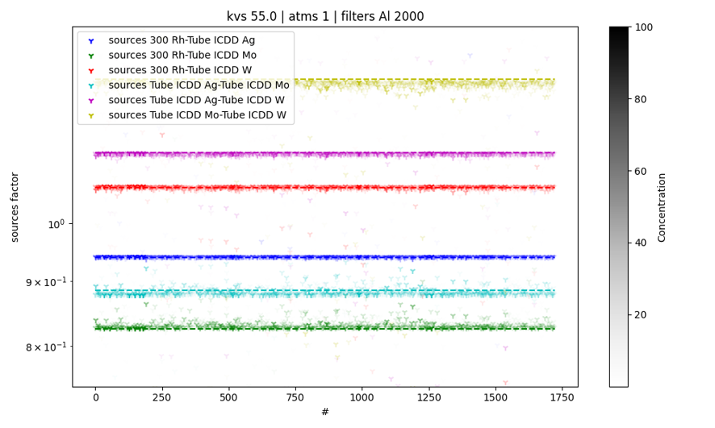
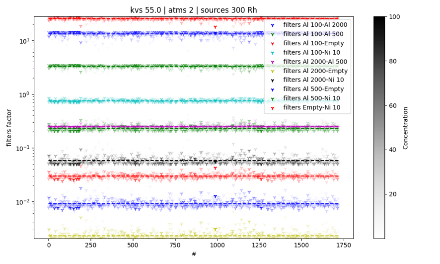
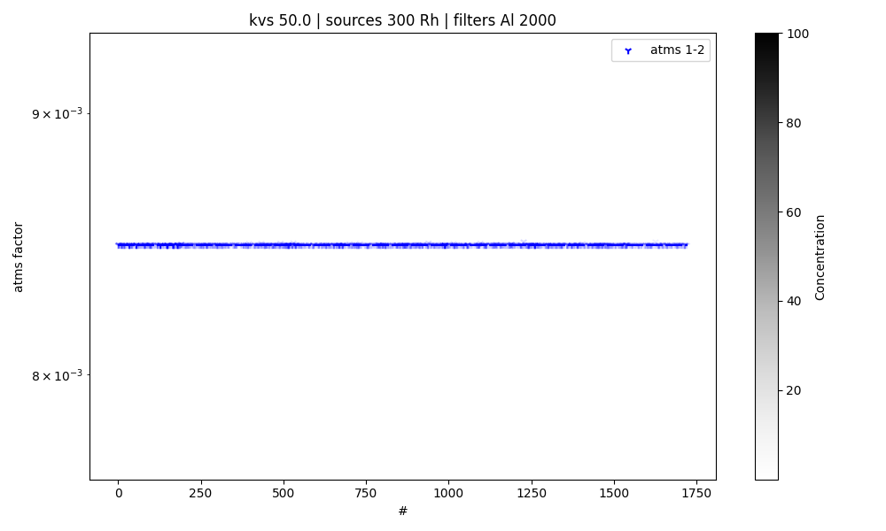
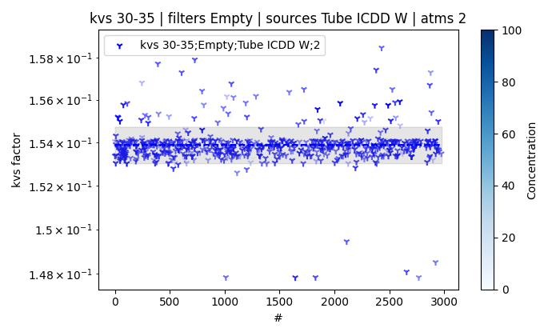
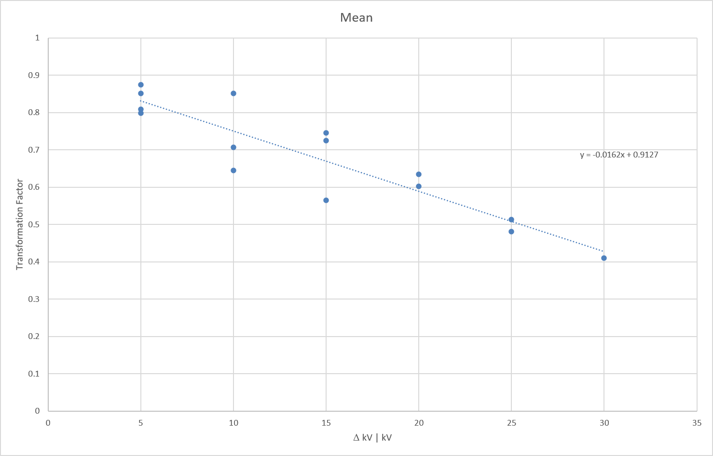

.. _ref-supported-formats:

Supported Formats
=================
The transformation of X-ray fluorescence data from one setup configuration to another can be approximated with a factor multiplication.

   .. math::
      :name: factor transformation
      
      \Phi_{\tiny{\begin{bmatrix} kV\\Filter\\Source\\Atmosphere \end{bmatrix}}}
      = \text{Factor}_{\tiny{\begin{bmatrix} kV\\Filter\\Source\\Atmosphere \end{bmatrix}}}
      \cdot \Phi0_{\tiny{\begin{bmatrix} kV_0\\Filter_0\\Source_0\\Atmosphere_0 \end{bmatrix}}}

Each factor can be calculated with the following equations: 

   .. math::
      :name: factor filter-source-atm
      
      \text{Factor}_{\tiny{\begin{bmatrix} kV\\Filter\\Source\\Atmosphere \end{bmatrix}}}
      = \frac{\Phi_{\tiny{\begin{bmatrix} kV\\Filter\\Source\\Atmosphere \end{bmatrix}}}}{\Phi0_{\tiny{\begin{bmatrix} kV\\Filter_0\\Source_0\\Atmosphere_0 \end{bmatrix}}}}

To perform the factor analysis sensitivity analysis, the class *transformation_factor* in the **factor_evaluation.py** script is utilised.
The class is initiated  

   .. code-block:: python

      factor_calc = TransformationFactor(
         db=db,
         alias=alias,
         host=host,
         port=port
         )

With the initiated class all base data has to be read out and registered in the class in order to further analyse the sensitivity.

   .. code-block:: python

      factor_calc.load_data(samplesize=samplesize)

Now all the data is available for analysis and the transformation factor analysis can be performed:

   .. code-block:: python

      factor_calc.eval_factors(
         entry=entry,
         save=True,
         savepath=savepath
         )

.. _ref-factors:

*Figure 1: Plotted are the calculated factors for the high voltage, source targets, filters and atmosphere transformation for an example spectrometer configuration.*
   
In :ref:`Figure 1 <ref-factors>` the calculated factors for example spectrometer configurations are displayed. All factors show a constant.

The high voltage parameter is a special case. 

.. _ref-kv-factor:

   Figure 2: The kV transformation factor shows a linear dependency with the difference of the spectrometer kV values. In future this linear dependency could be approximated with linear regression to allow a fine tuned transformation for the high voltage, e.g. allow transformation in 1 kV steps.
   THIS IS NOT YET IMPLEMENTED!

In :ref:`Figure 2 <ref-kv-factor>` the kV transformation factor for a specific spectrometer configuration is displayed. The factors shows a linear dependency with the difference of the spectrometer kV values. In future this linear dependency could be approximated with linear regression to allow a fine tuned transformation for the high voltage, e.g. allow transformation in 1 kV steps.
**THIS IS NOT YET IMPLEMENTED!**

To generate a database for the Transformation Factors the *factor_database_creation* function can be used. This creates an excel sheet containing all factor means, median, standard deviation and variance.
To execute the function call the following code:

   .. code-block:: python

      factor_calc.factor_database_creation(
         timestamp=timestamp,
         entry=entry,
         savepath=savepath
         )

Factor Evaluation Class
-----------------------
The class transformation_factor allows the loading of the data and different evaluation methods.

.. autoclass:: factor_evaluation.TransformationFactor
    :members:
    :undoc-members: